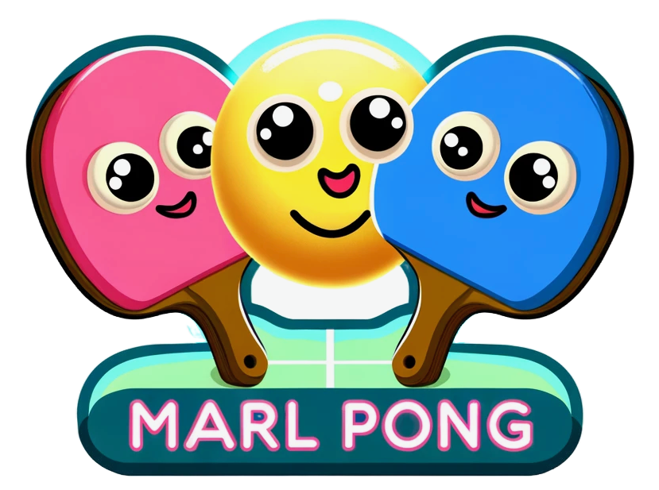
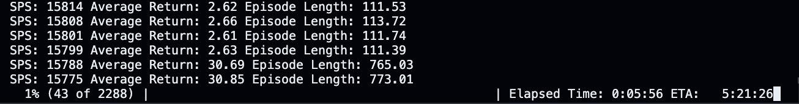

<a name="readme-top"></a>

<br />
<div align="center">
  <h2 align="center">Cornelius Wolff Thesis Repository</h2>

  <div align="center">
    
  </div>

  <p align="center">
    Work still in progress.
  </p>
</div>

<br/>

## Table of Contents
- [Table of Contents](#table-of-contents)
- [About The Project](#about-the-project)
- [Getting Started](#getting-started)
  - [Installation](#installation)
- [Usage](#usage)
- [Environment and Reward](#environment-and-reward)
  - [Ball Movement and Wall Collision](#ball-movement-and-wall-collision)
  - [Reward Calculation](#reward-calculation)
  - [Language channel](#language-channel)
- [Contact](#contact)

<p align="right">(<a href="#readme-top">back to top</a>)</p>

## About The Project

In this repository, I publish the code of my thesis.

<p align="right">(<a href="#readme-top">back to top</a>)</p>


## Getting Started

To execute my experiments, the environment and my reinforcmenet learning code has to be installed as a package first. Clone this repository, navigate with your terminal into this repository and execute the following steps.

### Installation

1. Install the repository as a pip package
   ```sh
   pip install .
   ```
2. Check whether the installation was successful
   ```sh
   python -c "import ThesisPackage"
   ```

<p align="right">(<a href="#readme-top">back to top</a>)</p>


## Usage

The basic multi agent pong environment can be imported and trained like this:<br/><br/>

```python
from ThesisPackage.Environments.collectors.collectors_env_discrete_onehot import Collectors
from ThesisPackage.RL.Centralized_PPO.multi_ppo import PPO_Multi_Agent_Centralized

if __name__ == "__main__":
    num_envs = 64
    seed = 1
    total_timesteps = 6000000000
    
    sequence_length = 1:
    envs = [make_env(sequence_length) for i in range(num_envs)]

    agent = PPO_Multi_Agent_Centralized(envs, device="cpu")

    agent.train(total_timesteps, tensorboard_folder="OneHot", exp_name=f"collect_seq_{sequence_length}", anneal_lr=True, learning_rate=0.001, num_checkpoints=60)

    agent.save(f"models/collectors_seq_{sequence_length}")
```

If you want to train your setup as a self-play sender-receiver setup, you can do it like this:
```python
from ThesisPackage.Environments.multi_pong_sender_receiver import PongEnvSenderReceiver
from ThesisPackage.RL.Decentralized_PPO.multi_ppo import PPO_Multi_Agent

def make_env(seed, vocab_size, sequence_length, max_episode_steps):
    env = PongEnvSenderReceiver(width=20, height=20, vocab_size=vocab_size,sequence_length=sequence_length, max_episode_steps=max_episode_steps, self_play=True, receiver="paddle_2", mute_method="zero")
    return env

if __name__ == "__main__":
    i = 4
    num_envs = 64
    seed = 1
    sequence_length = i
    vocab_size = 3
    max_episode_steps = 2048
    total_timesteps = 150000000
    envs = [make_env(seed, vocab_size, sequence_length, max_episode_steps) for i in range(num_envs)]
    agent = PPO_Multi_Agent(envs)
    agent.train(total_timesteps, exp_name="multi_pong_sender_receiver")
    agent.save(f"models/multi_pong_test_sender_receiver_{i}")
```

The output of this code will look like this:
<div align="center">
  
</div>

<p align="right">(<a href="#readme-top">back to top</a>)</p>

## Environment and Reward

### Ball Movement and Wall Collision

- The ball moves according to its current direction. If it hits the top or bottom wall, its vertical direction reverses, simulating a bounce.

- When the ball hits the left wall, its horizontal direction reverses, making it bounce back into play.

### Reward Calculation

- Initially, all paddles have a reward of 0. This setup indicates that no paddle has earned a reward yet.

- The environment checks if the ball is at the right edge and in line with any paddle. If a paddle successfully hits the ball (the ball's vertical position aligns with the paddle's position), that paddle receives a reward of 1, rewarding the paddle for hitting the ball back.

- The rewards are calculated based on the ball's interaction with the paddles and the walls, focusing on rewarding paddles for successfully hitting the ball back into play.

<p align="right">(<a href="#readme-top">back to top</a>)</p>

### Language channel
The language channel uses discrete language tokens. The size of the language channel and the number of vocabulary are handed over as hyperparameters to the pong environment.

<p align="right">(<a href="#readme-top">back to top</a>)</p>

## Contact

Cornelius Wolff - cowolff@uos.de

<p align="right">(<a href="#readme-top">back to top</a>)</p>
